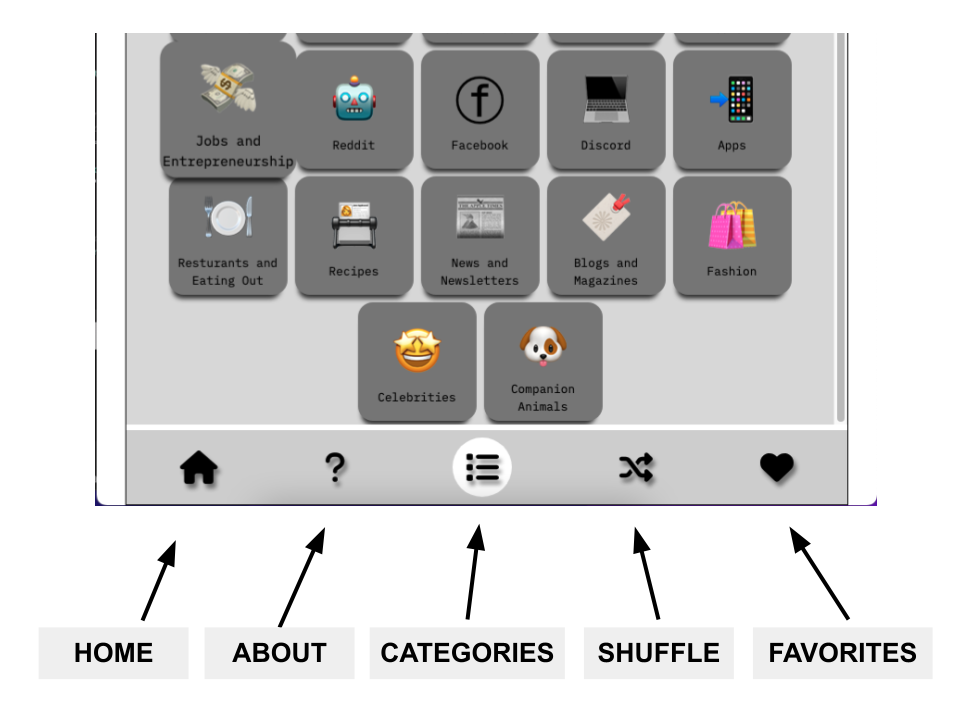
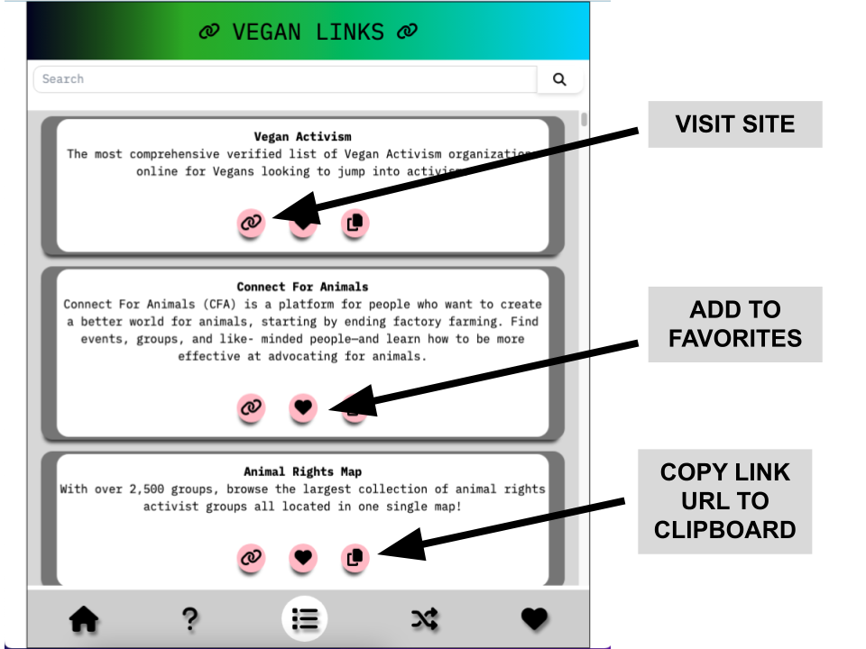

<!-- ABOUT THE PROJECT -->
## About The Project
####The Vegan Links App

.

I was inspired by a public spreadsheet avaible online called the Vegan Cheat Sheet, an aggregated list of over 440 different vegan links. I wanted to build a with an alternate graphical user interface and additional features. The ultimate purpose of this app is to help vegan and non vegans refrence, discover and share vegan resources.

A few features:
* Over 440 vegan links organized by over 20 categories, inlcuding  'activism' , 'nutritional studies', 'movies',
* Search by category or keyword
* A 'Favorites' feature to save your favored links
* Easily share links with friends and family


### Built With

I used Mimo, an online web wireframing and design app to build the design layout. The app is built in React, using the useContext() hook for state management.


* React
* React Toastify
* Font Awesome
* Local storage


<!-- LIVE SITE -->
## Visit The LIve Site

https://vegan-links.vercel.app/


<!-- GETTING STARTED -->
## Getting Started

To get a local copy up and running follow these simple example steps.

### Prerequisites

You will need npm if you don't already have it installed on your computer. Run this command in your terminal or command line
  ```
npm install npm@latest -g
  ```

### Installation


1. Clone the repo
   ```sh
   git clone https://github.com/benjahmin-koenigsberg/Vegan_Links
   ```
2. Install NPM packages
   ```sh
   npm install
   ```
3. Run on a local server
   ```sh
   npm run start
   ```

<!-- USAGE EXAMPLES -->
## Usage






<!-- What's Next ? -->
## Whats NExt ?

- [] Add descriptions for each link
- [] Create a mobile version from a progrssive web app

<!-- CONTRIBUTING -->
## Contributing

Contributions are what make the open source community such an amazing place to learn, inspire, and create. Any contributions you make are **greatly appreciated**.


1. Fork the Project
2. Create your Feature Branch (`git checkout -b feature/AmazingFeature`)
3. Commit your Changes (`git commit -m 'Add some AmazingFeature'`)
4. Push to the Branch (`git push origin feature/AmazingFeature`)
5. Open a Pull Request


<!-- ACKNOWLEDGMENTS -->
## Acknowledgments

This site is completely inspired by and utlilizes links from the Vegan Hacktivist's Cheat Sheet

* [The Vegan Hacktivist](https://veganhacktivists.org)
* [The Vegan Cheat Sheet](https://vegancheatsheet.org)
* [Traversey Media](https://traversymedia.com/)
